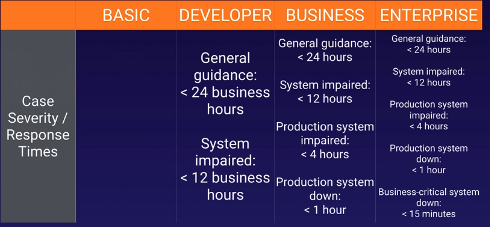
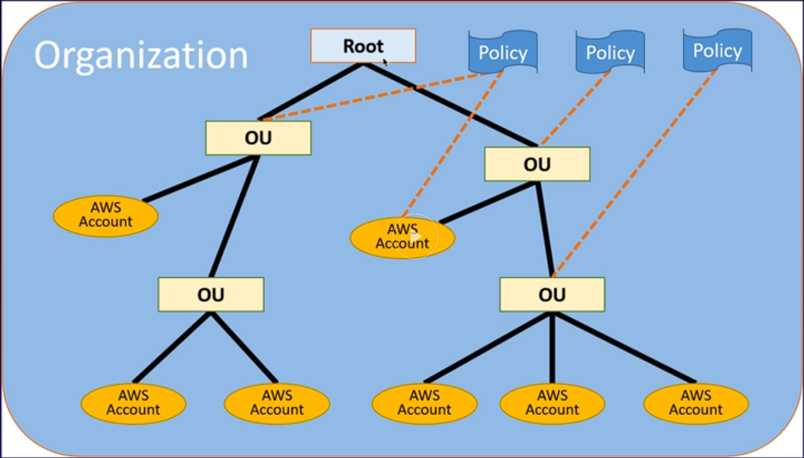
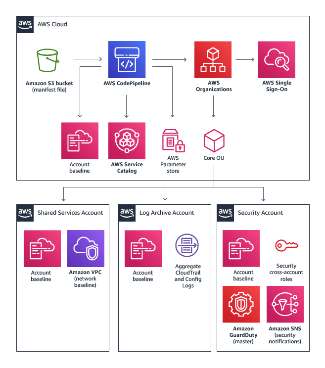
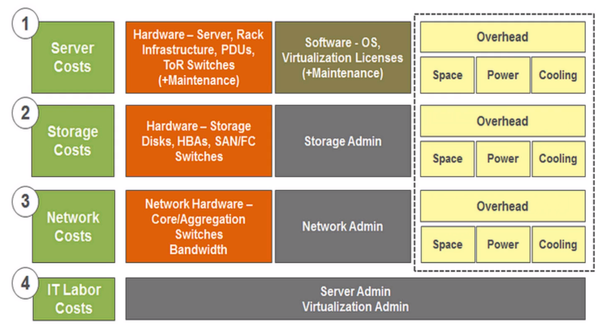

# Billing & Pricing

Second part of the A Cloud Guru course

- [Billing & Pricing](#billing--pricing)
  - [**How AWS pricing works**](#how-aws-pricing-works)
    - [CAPEX](#capex)
    - [OPEX](#opex)
    - [Pricing policies](#pricing-policies)
    - [Best practices](#best-practices)
      - [Understand the fundamentals of pricing](#understand-the-fundamentals-of-pricing)
      - [start early with cost optimization](#start-early-with-cost-optimization)
      - [maximize the power of flexibility](#maximize-the-power-of-flexibility)
      - [use the right pricing model for the jobs](#use-the-right-pricing-model-for-the-jobs)
    - [Free tier](#free-tier)
      - [free services](#free-services)
    - [EC2 pricing](#ec2-pricing)
      - [EC2 pricing models](#ec2-pricing-models)
    - [Lambda pricing](#lambda-pricing)
    - [EBS pricing](#ebs-pricing)
    - [S3 pricing](#s3-pricing)
    - [Glacier pricing](#glacier-pricing)
    - [Snowball pricing](#snowball-pricing)
    - [RDS pricing](#rds-pricing)
    - [DynamoDB pricing](#dynamodb-pricing)
    - [Cloudfront pricing](#cloudfront-pricing)
  - [**Budget**](#budget)
  - [**Cost explorer**](#cost-explorer)
  - [**Support plans**](#support-plans)
    - [Basic](#basic)
    - [Developer](#developer)
    - [Business](#business)
    - [Enterprise](#enterprise)
    - [TAM](#tam)
    - [Response times](#response-times)
  - [**Tagging and resource groups**](#tagging-and-resource-groups)
    - [Tags](#tags)
      - [Tags information](#tags-information)
    - [Resource group](#resource-group)
      - [Create groups (SSM)](#create-groups-ssm)
    - [Tag Editor](#tag-editor)
  - [**Organizations and consolidated billing**](#organizations-and-consolidated-billing)
    - [organization flavors](#organization-flavors)
      - [Organizations full access](#organizations-full-access)
      - [Organization just with Consolidated billing](#organization-just-with-consolidated-billing)
        - [consolidated billing Advantages](#consolidated-billing-advantages)
    - [Organization best practices](#organization-best-practices)
  - [**CloudTrail**](#cloudtrail)
    - [Cloudtrail with organizations](#cloudtrail-with-organizations)
    - [cloudtrail notes](#cloudtrail-notes)
  - [**Quick starts**](#quick-starts)
  - [**Landing Zone**](#landing-zone)
  - [**Calculators**](#calculators)
    - [Simple monthly calculator](#simple-monthly-calculator)
    - [Total cost of ownership calculator (TCO-calculator)](#total-cost-of-ownership-calculator-tco-calculator)

## **How AWS pricing works**

---

### CAPEX

> capital expenditure, where you pay up front

### OPEX

> operational expenditure, pay for what you use

### Pricing policies

- You pay as you go
- pay for what you use
- pay less as you use more
- pay even less when reserve

### Best practices

#### Understand the fundamentals of pricing

- compute
- storage
- data outbound

#### start early with cost optimization

- put cost visibility
- control mechanisms
  - before the environments grows large and complex

#### maximize the power of flexibility

- no minimum commitment
- pay for service on an as-needed basis
  - focus on innovation and invention
  - reducing procurement complexity
  - enabling business to be fully elastic
- don't pay for them when not using

#### use the right pricing model for the jobs

- on demand
- dedicated instances
- spot instances
- reservations

### Free tier

> help new customers, run free amazon resources

#### free services

- VPC (virtual data center in the cloud)
- Elastic Beanstalk (resources that it provisions are not free)
- Cloudformation
- IAM
- Auto Scaling
- OpsWorks
- Consolidated billing

### EC2 pricing

What determines price:

- clock hours of server time
- instance type
- pricing mode
- number of instances
- load balancing
- detailed monitoring (if enabled)
- Auto scaling (if creates instances)
- Elastic IP Addresses
- Operating systems and software packages

#### EC2 pricing models

- on demand
  - fixed rates
- reserved
  - discount based on contract time and up front payment 
- spot
  - bid on capacity
- dedicated hosted
  - physical EC2 server

### Lambda pricing

- Request pricing
  - Free tier: 1 million requests per month
  - $0.20 per 1 million request thereafter
- duration pricing
  - 400.000 GB-seconds per month free, up to 3.2 million seconds of compute time
- additional charges
  - Reads and write data to s3

### EBS pricing

- Volumes (per GB)
- snapshots (per GB)
- data transfer

### S3 pricing

- Storage class (standard, intelligent-tiering, etc.)
- Storage
- Requests (GET, PUT COPY)
- data transfer

### Glacier pricing

- Storage
- data retrieval time 

### Snowball pricing

> PB-scale data transport solution, gigantic disk used to move data in to AWS

- service fee per job
  - 50 TB: $200
  - 80 TB: $250
- daily charge
  - first 10 days free, after $15 a day
- data transfer
  - in to AWS free, out is not

### RDS pricing

- Clock hours of server time
- DB characteristic (if SQL)
- DB purchase type
- number of DB instances
- provisioned storage (how big in GB)
- additional storage
- requests
- deployment type
- data transfer

### DynamoDB pricing

### Cloudfront pricing

- traffic distribution
- requests
- data transfer out

## **Budget**

---

> gives the ability to set custom budgets that alert yo when your costs or usage exceed or are near

- Use it to budget cost BEFORE they have been incurred
- has to be enabled

## **Cost explorer**

---

> interface that allows to visualize, understand and manage AWS cost over time

- Used to explore cost AFTER they have been incurred

## **Support plans**

---

### Basic

- Free

### Developer

- $29
- access to AWS support explicitly during business hours via email

### Business

- $100
- 24x7

### Enterprise

- $15000
- 24x7

### TAM

Someone who is dedicated at AWS for your business

### Response times

## **Tagging and resource groups**

---

### Tags

- Key value pairs attached to AWS resources
- metadata
- tags can be inherited

#### Tags information

- EC2 - public and ip address
- ELB - port configurations
- RDS - DB engine

### Resource group

> make it easy to group resources using tags assigned to them, can group resources that share one or more tags

- group resources by
  - Region
  - name
  - employee ID
  - env
- resources can be grouped

#### Create groups (SSM)

> query based group

- per region basis
- Lets you run SSM automation's on the resource groups

### Tag Editor

> great way to find all your tags, and resources, and create new tags

- Global service

- Select
  - regions
  - resource types
  - tags

## **Organizations and consolidated billing**

---

> account management service enables to consolidate multiple AWS accounts into a organization, and centrally manage them

- global service
- provides single payer and centralized cost tracking
- create and invite accounts
  - cant invite other root accounts
- apply policy-based controls
- Gets the benefit of economies of scale
  - cheaper rates

### organization flavors

two ways

#### Organizations full access

- full organization access with policies and OUs
- all features

#### Organization just with Consolidated billing

- one account pays all of the other accounts
- benefits from economies of scale
- paying account is independent

##### consolidated billing Advantages

- one billing
- benefit from economies of scale
  - AWS services sums in the billing account

### Organization best practices

- enable MFA on root account
- use strong and complex password
- billing account for billing only
- limit of 20 accounts
- monitor enabled in billing account, bring billing data from all the other accounts
  - create billing alerts by accounts
- unused reserved instances for EC2 are applied across the groups

## **CloudTrail**

---

> Monitors API calls within AWS

- auditing tool
- logs API calls
- Per account, per region

### Cloudtrail with organizations

- turn on cloudtrail in paying account
- create bucket policy that allows cross-account access
- turn on cloudtrail in the other accounts and use the bucket in the paying account

### cloudtrail notes

- AWS CloudTrail is now enabled by default for ALL CUSTOMERS and will provide visibility into the past seven days of account activity without the need for you to configure a trail in the service to get started

## **Quick starts**

---

> Environments created by solutions architects to help with a particular technology quickly

- uses cloudformation templates to provision the things it need to implement the solution
- deploys solutions into the aws, design by experts
- free to use
  - provisioned resources are not

## **Landing Zone**

---

> Set up a multi-account AWS environment at the click of a button

- based on best practices
- starts with 4 different accounts

## **Calculators**

---

> help calculate the costs

### Simple monthly calculator

- static website on s3
- allows to to built an environment and estimate the cost
- calculates the monthly cost of AWS
- not a comparison tool

### Total cost of ownership calculator (TCO-calculator)

- whats is it costing you to have your servers on-premise
- vs putting them in the cloud
- compares the cost of AWS vs On-prem
- convincing executives to move to the cloud
- generates reports, to make business decisions

