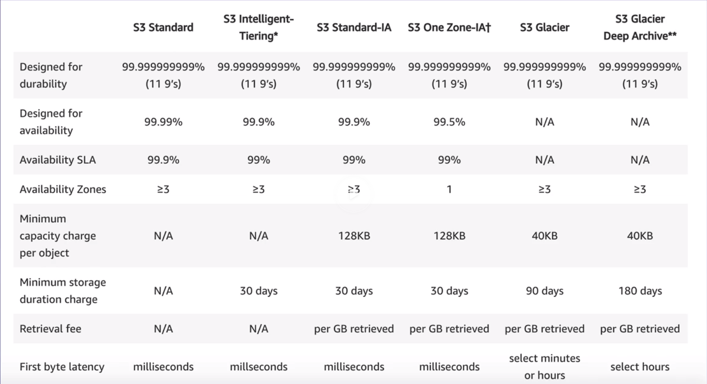
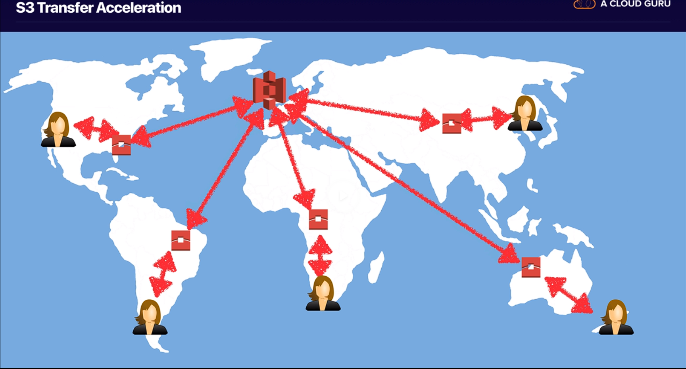
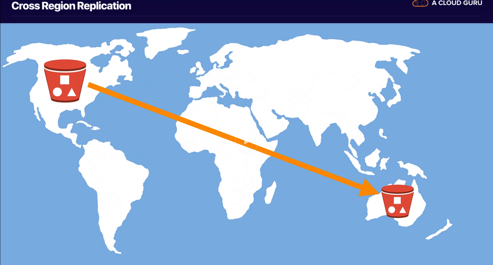
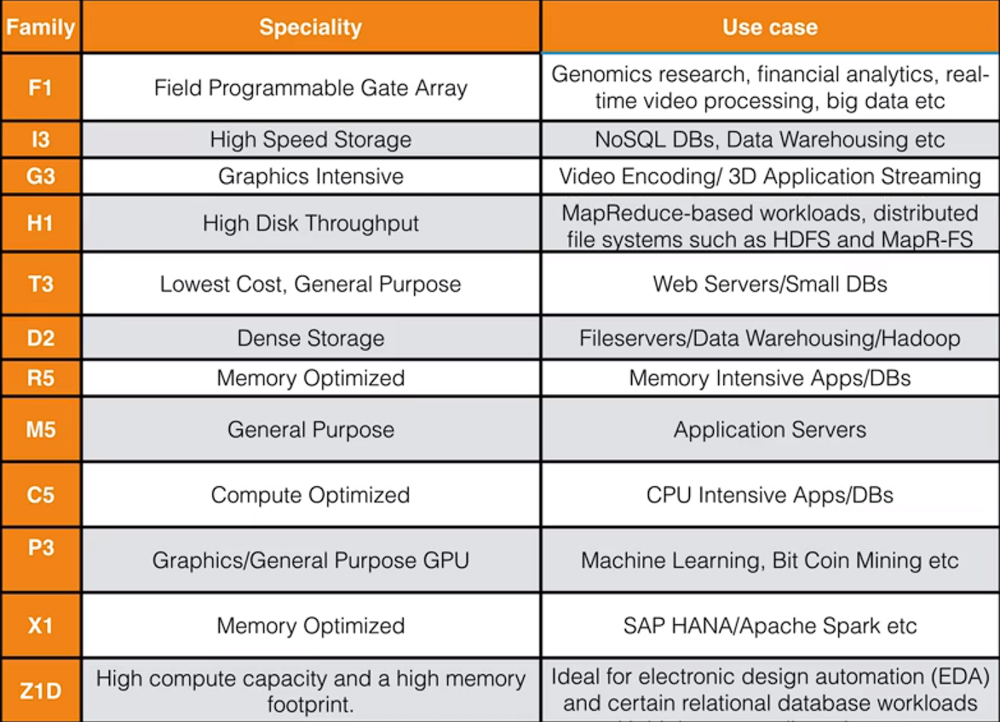
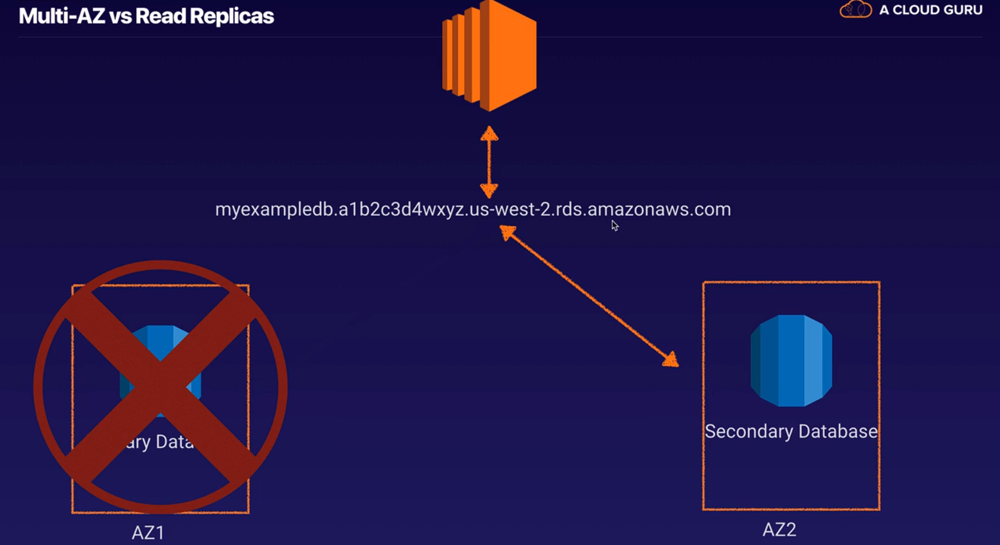
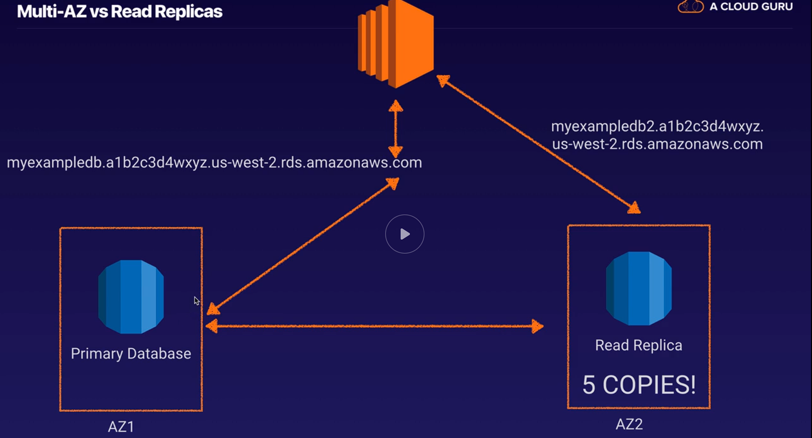

# **Cloud Concepts And Technology**

First part of the A Cloud Guru course

- [**Cloud Concepts And Technology**](#cloud-concepts-and-technology)
  - [**What is cloud computing?**](#what-is-cloud-computing)
    - [Know the 6 advantaged of cloud](#know-the-6-advantaged-of-cloud)
    - [Know the 3 types of cloud computing](#know-the-3-types-of-cloud-computing)
    - [Know the 3 types of cloud computing deployments](#know-the-3-types-of-cloud-computing-deployments)
  - [**Around the world with AWS**](#around-the-world-with-aws)
    - [AWS global infrastructure](#aws-global-infrastructure)
    - [Choosing right AWS region](#choosing-right-aws-region)
  - [**Support plans**](#support-plans)
  - [**IAM**](#iam)
    - [Exam tips](#exam-tips)
  - [**S3 101**](#s3-101)
    - [Tips](#tips)
    - [Create website using S3](#create-website-using-s3)
  - [**Cloudfront**](#cloudfront)
    - [Key terminology](#key-terminology)
    - [Distributions](#distributions)
    - [Origin](#origin)
    - [Cloudfront Notes](#cloudfront-notes)
  - [**EC2 101**](#ec2-101)
    - [Pricing models](#pricing-models)
      - [1. On demand](#1-on-demand)
      - [2. Reserved](#2-reserved)
      - [3. Spot](#3-spot)
      - [4. Dedicated hosts](#4-dedicated-hosts)
    - [Instance types](#instance-types)
    - [EBS](#ebs)
      - [Types](#types)
    - [EC2 - Tips](#ec2---tips)
    - [Common ports](#common-ports)
    - [Security group](#security-group)
    - [**Creating a web server on EC2**](#creating-a-web-server-on-ec2)
    - [User data](#user-data)
    - [EC2 Tips](#ec2-tips)
  - [**Command line**](#command-line)
  - [**Roles**](#roles)
  - [**Web server**](#web-server)
  - [**Lets use elastic load balancer**](#lets-use-elastic-load-balancer)
    - [ALB](#alb)
  - [**Databases 101**](#databases-101)
    - [RDS](#rds)
      - [RDS Flavors](#rds-flavors)
      - [Features](#features)
    - [Non-RDS](#non-rds)
      - [Non RDS Flavors](#non-rds-flavors)
    - [Data warehousing (Redshift)](#data-warehousing-redshift)
    - [ElastiCache](#elasticache)
      - [Example](#example)
      - [ElastiCache engines](#elasticache-engines)
    - [Graph databases (neptune)](#graph-databases-neptune)
  - [**Autoscaling**](#autoscaling)
  - [**Domain name - Route53**](#domain-name---route53)
    - [Amazon Route53](#amazon-route53)
    - [Routings](#routings)
      - [Failover](#failover)
      - [Latency-based Routing](#latency-based-routing)
    - [Hosted zones](#hosted-zones)
  - [**Elastic Beanstalk**](#elastic-beanstalk)
    - [EB Notes](#eb-notes)
  - [**Lets look at cloudformation**](#lets-look-at-cloudformation)
  - [**Architecting for the cloud - best practices**](#architecting-for-the-cloud---best-practices)
    - [Traditional computing vs cloud computing](#traditional-computing-vs-cloud-computing)
    - [Scalability](#scalability)
    - [Deposable resources instead of fixes servers](#deposable-resources-instead-of-fixes-servers)
    - [Automation](#automation)
    - [Loose coupling](#loose-coupling)
    - [Services not servers](#services-not-servers)
    - [Databases](#databases)
    - [managing increasing columns of data](#managing-increasing-columns-of-data)
    - [removing single points of failure](#removing-single-points-of-failure)
    - [optimize for cost](#optimize-for-cost)
    - [caching](#caching)
    - [security](#security)
  - [**Global AWS services**](#global-aws-services)
  - [**What AWS services can be used on premise**](#what-aws-services-can-be-used-on-premise)
    - [snowball](#snowball)
    - [snowball edge](#snowball-edge)
    - [storage gateway](#storage-gateway)
    - [codedeploy](#codedeploy)
    - [opsworks](#opsworks)
    - [IOT greengrass](#iot-greengrass)
  - [**Cloudwatch 101**](#cloudwatch-101)
    - [cloudwatch tips](#cloudwatch-tips)
  - [**AWS SSM**](#aws-ssm)
    - [SSM Tips](#ssm-tips)

## **What is cloud computing?**

---

### Know the 6 advantaged of cloud

- Trade capital expense for variable expense
- Benefit from massive economies of scale
- Stop guessing about capacity
- Increase speed and agility
- Stop spending money running and maintaining data center
- Go global in minutes

### Know the 3 types of cloud computing

- Infrastructure as a service (IaaS) Example: EC2
- Platform as a service (PaaS) Example: Elastic Beanstalk, Amazon LightSail
- Software as a service (SaaS) Example: Gmail

### Know the 3 types of cloud computing deployments

- Public cloud - Example: AWS
- Private cloud - Example: On premise
- Hybrid cloud - Mixture of public and private

## **Around the world with AWS**

---

### AWS global infrastructure

- 24 regions and multiple AZs
- Region is a geographical area, consists of two or more AZs
- Availability zone is one or more discrete data centers, each with redundant power, networking and connectivity, separated by miles
- Edge locations are endpoint for AWS for caching content, A site that CloudFront uses to cache copies of your content for faster delivery to users at any location.
  - Connected to AZs through Amazon private network

### Choosing right AWS region

- Data sovereignty laws
- Latency to end users
- AWS Services (us-east-1 primary region)

## **Support plans**

---

- Basic - free
- Developer - ask technical question support center, 12-24 hour response - 29$
- Business - 24x7 support 1 hour response rate, full access to trusted advisor - 100$
- Enterprise - Business and TAM, 15 min response rate - 15.000$

## **IAM**

---

- Allows to create Users, roles, groups, etc.

- Root user is the email that was used to create the account
  - don't use it
- Activate MFA on root account
- Create individual IAM users
  - Programmatic
    - CLI
    - SDK
  - Management console
- Use groups to assign permission
  - Users added to a group inherit permissions from the group
- Password policy

### Exam tips

- Its global
- Access - console, cli, sdk
- Root account is the email, always have full administrator access, secure it with MFA
- Group, place to store users
- Policy are write in JSON (JavaScript object notation) used to give permission

## **S3 101**

- Simple storage service, longest aws services
- Provides secure, durable, highly-scalable object store
- Basically a place to put files, txt, videos, etc.
  - Flat files, that means, that doesn't change (data base files)
- Safe place to store files
- Object-based storages
  - Different from block-based storage to store operating system
- Data is spread across multiple devices and facilities
- Files from 0 to 5TB
- Files are stored in buckets - folder in the cloud
- "unlimited" storage
- S3 is a universal namespace - name must be unique
- uploading a file to s3 returns a HTTP code
- Object are like files
  - Key - name of the object
  - value - data made up of a sequence of bytes
  - Version ID
  - Metadata - Data about you are storing
  - sub resources
- Data Consistency
  - Read after write consistency from PUTS of new objects
    - If you write a new file into S3 and read it immediately you will access the file
  - Eventual consistency for overwrite PUTS and DELETES (can some time to propagate)
    - If you update an existing file or delete a file and read it immediate, you may get older version, or you may not. Changes can take time
- Built for 99.99% availability for the S3 platform
- Amazon guarantee 99.9% availability
- Amazon guarantees 99.999999999% durability for s3 information

- Following feature
  - Tiered storage
  - Lifecycle management
  - Versioning
    - Version control
  - Encryption
  - Secure data using Access control lists and bucket policies
    - Access control list is on individual file basis, one file or object can only be accessed by one person or role
    - bucket policies works on a bucket level

- Storage classes
  - S3 standard
    - Redundant across multiple devices in multiple facilities, designed to sustain the loss of 2 facilities concurrently
  - S3 - IA (Infrequently accessed)
    - Data tha is less frequently accessed, but requires rapid access when needed. Lower fee than s3, but charged on retrieval
  - S3 one zone - IA
    - Low cost for infrequently accessed data, don't require multiple AZ resilience
  - S3 - Intelligent tiering
    - Optimize costs by automatically moving data to the most cost effective access tier, without performance impact
  - S3 glacier
    - secure, durable and low cos storage class for data archiving. Retrieval times configurable from minutes to hours, cost cheaper than on-premise
  - S3 glacier deep archive
    - Amazon S3's lowest-cost storage class where a retrieval of 12 hours is acceptable



- Charges
  - Storage (per GB)
  - Requests (number of requests)
  - Storage management pricing
  - Data transfer pricing
  - Transfer acceleration
    - Enables fast, easy and secure transfers of files over long distances between your end users and an s3 bucket, takes advantage of edge locations, users upload files to the edge location instead of the bucket, and it thens goes through amazon internal network to the bucket 
  - Cross region replication
    - Replicate a bucket in another region, it replicates automatically, disaster recovery 

### Tips

- When you view buckets you view them globally but you can have buckets in individual regions
- Replicate the contents of one bucket to another automatically using cross region replication
- Change the storage class and encryption of the objects on the fly
- Restricting bucket access
  - Bucket policies - applies across the whole bucket
  - Object policies - applies to individual files
  - IAM policies to users, groups and roles

### Create website using S3

Serverless website because S3 doesn't consist of any servers

make the s3 a static website hosting, setting

- the index document
- error document
- s3 public policy

Notes

- Static website means is html images, movies, etc. Its not dynamic, not connecting to DB showing dynamic content

- Dynamic website cannot be hosted on S3

- S3 scales automatically to meet demands

## **Cloudfront**

- Amazons content delivery network (CDN), is a system of distributed servers (network) that deliver webpages and other web content to a user based on the geographic locations of the user.

### Key terminology

- Edge location: This is the location the content will be cached. This is separate to an AWS region/AZ
- Origin: This is the origin of all the files that the CDN will distribute. can be S3, EC2 instance, ELB or R53
- Distribution: This is the name given the CDN which consists of a collection of Edge locations

Content is cached in places near the users for a faster response

- first users gets added latency since content is not cached
- all users after first will be able to access it from the cloudfront faster
- File is cached for a length of time
  - TTL Time to live - given in seconds, around 48 hours

Cloudfront can be used to deliver the entire website, including dynamic, static, streaming and interactive content using a global network of edge location
Request for the content are automatically routed to the nearest edge location

### Distributions

- Web distribution - used for website
- RTMP - used for media streaming
  - Used for flash, not commonly used

### Origin

> where content is stored, from which cloudfront gets connect to serve to viewers

- An Amazon S3 bucket that is configured with static website hosting
- An Elastic Load Balancing load balancer
- An AWS Elemental MediaPackage origin
- An AWS Elemental MediaStore container
- Any other HTTP server, running on an Amazon EC2 instance or any other kind of host
- R53?

### Cloudfront Notes

- Edge location are not just READ only, you can write in them too (put an object on to them)
- You can clear cached object, but will be charged

## **EC2 101**

---

> EC2 is just a virtual server or servers in the cloud

### Pricing models

#### 1. On demand

Pay a fixed rate by the hour, no commitment

   1. low cost and flexibility
   2. short term, spiky unpredictable workloads, that cannot be interrupted
   3. first time apps

#### 2. Reserved

Capacity reservation, significant discount depending on the upfront payment its given the discount, contract are 1 or 3 years, and 3 years contract have the biggest discount

   1. steady state or predictable usage
   2. reserved capacity
   3. users able to make upfront payments

Types:

- Standard reserved instances: Up to 75%, cant change the EC2 family, or attributes (memory disk)
- Convertible reserved instances: up yo 54% capability of changing the instance attributes as long as the change results in the creation of equal or greater value
- Schedule reserved instances: available to launch within the time windows you reserve. match capacity to predictable schedule, day, week or month

#### 3. Spot

Enables you to bid what ever price you want for instance capacity, greater saving if applications have flexible star and end times

- Flexible star and end times
- Only feasible at very low compute prices
- User with urgent computing need for large amounts of additional capacity

#### 4. Dedicated hosts

Physical EC2 servers dedicated for your use. allows existing server-bound software licenses

- Regulatory requirements, may not support multi-tenant virtualization
- Great for licensing that doesn't support multi-tenant virtualization or cloud deployments
- Can be purchased
  - on-demand
  - reservation

### Instance types



FIGHT DR Mc PXZ

- F - for FPGA
- I - for IOPS
- G - Graphics
- H - High disk throughput
- T- Cheap general purpose
- D - Density
- R - RAM
- M - Main choice for general purpose apps
- C - Compute
- P - Graphics (Pics)
- X - Extreme memory
- Z - Extreme memory and CPU

### EBS

> Virtual hard disks that EC2 uses, every server has a disk, every virtual server has a virtual disk

Creates storage volumes and attach them to EC2 instances

- Create file systems
- Run data base
- Install OS
- Block device
- Sett up in a specific AZ, where they are automatically replicated

#### Types

- SSD
  - General purpose (GP2): balances price and performance
  - Provisioned IOPS SSD (IO1): High performance SSD, for low-latency or high-throughput workload
- Magnetic
  - Throughput optimized HDD (ST1): low cost, frequently accessed
  - Cold HDD (SC1): Lowest cost HDD, less frequently accessed, Files servers
  - Magnetic: previous generation

### EC2 - Tips

- Web service that provides resizable compute capacity
- Virtual server in the cloud
- Spot instance is terminated by AWS, not charged for partial usage, if terminated by the user, charged for the hour

### Common ports

- linux ssh 22
- microsoft remote desktop protocol port 3389
- HTTP port 80
- HTTPS port 443

### Security group

Virtual firewall

0.0.0.0/0 - everyone

### **Creating a web server on EC2**

- Create EC2
- open port 80 to world

### User data

```shell
!#/bin/bash
yum update -y
yum install httpd -y
service httpd start
chkconfig on
cd /var/www/html
echo "<html><body><h1> Text </h1></body></html>" > index.html
```

Command 1

> !#/bin/bash, everything under that line will run at root , when the EC2 boots up

Command 2

> chkconfig on, if the EC2 instance reboots, the apache servers stars automatically

### EC2 Tips

- Always design for failure
  - have 1 EC2 instance in each AZ

## **Command line**

---

- Give credentials
  - aws configure
  - cd ~
  - cd .aws
- Use roles

## **Roles**

---

- Service that will use the role (trusted entities)
- Attach a policy
- Tags and names
- Credentials are not saved
- Safer way to interact
- Easier to manage
- Roles are universal, don't need a region

## **Web server**

---

Install a software that makes the EC2 a web sever

```shell
yum install httpd
service httpd start
cd /var/www/html
vim index.html
```

Then go to the Ip address of the instance

## **Lets use elastic load balancer**

---

- Application load balancers
  - Application aware, they can see into layer 7, make intelligent routing decisions
- Network load balancers
  - Used when needed ultra high performance and static IP addresses
- Classic load balancer
  - Getting phased out, cheap and cheerful
- By Default load balancers are redundant, spread through multiple AZs

### ALB

- scheme
  - Internet facing
  - Internal
- Ip address type
  - ipv4
- AZs
- SG
- Routing
  - Target group
  - Health checks
- Register targets
- Can be accessed bye the DNS, it resolves to the targets

## **Databases 101**

---

> Relational databases can be seen as a spreadsheet

- Database (file)
- Tables
- Row
  - Fixed number of columns, can be added, but will affect every single row
- Fields (Columns)

### RDS

Amazons RDS

#### RDS Flavors

> OLTP: Online transaction process, individual transaction at any given time

- SQL Server
- Oracle
- MySQL Server
- PostgreSQL
- Aurora
- Maria DB

#### Features

- Multiple-AZ, for DR
  - Detected automatically when the main fails
  - 

- Read Replicas, literally a copy of the DB, for performance
  - Primary data is copied to the read replicas
  - up to 5 read replicas
  - there is no automatic fail over in case of failure to the read replicas
  - Set up EC2 instances to write to primary DB and all their reads from read replicas
  - 

### Non-RDS

- Collection = table
- Document = row
- Key value pairs = fields

More flexibility

- The columns in the table can vary
- Doesn't affect other rows in the data base

#### Non RDS Flavors

- DynamoDB

### Data warehousing (Redshift)

> OLAP: online analytics processing, really large sorts of query

- Used for BI. Used to pull in very large and complex data sets. do queries on data (current performance vs targets)
- Do online analytics processing away from the production DB
- Queries don't impact primary DB, impact secondary DB made for this queries
- Tools like:
  - Cognos
  - Jaspersoft
  - Oracle Hyperion
- Different type of architecture, from a DB perspective and infrastructure layer
- Amazon data warehousing is redshift

### ElastiCache

- Web service that makes it easy to deploy, operate and scale in-memory cache in the cloud.
- Improves the performance of web applications by allowing them to retrieve information from fast, managed, in-memory caches instead of slower disk-based DBs
- Takes a massive load of the production DB
- Primary queries are made in ElastiCache
- Secondary queries are made in the DB

#### Example

ElastiCache is used by Amazon.com to cache the most common queries from the databases, returns them faster

#### ElastiCache engines

- Memcached
- Redis

### Graph databases (neptune)

- scalability
- high availability

## **Autoscaling**

---

> allows to provision multiple EC2 instances behind a load balancer automatically depending on demand

- Launch configuration:
  - How to configure the launch of the EC2 instance
- ASG
  - subnets
  - group size
  - network
  - Target groups
  - Scaling policies
    - between # instance
    - metric type
      - AVG CPU utilization

## **Domain name - Route53**

---

> DNS: Domain Name System, works like a phone book, process computers use to resolve domain names to IP addresses

- DNS works on port 53
- Its global
- Used to direct traffic and register domains

### Amazon Route53

When registering a DNS its good to have a bucket with the same name as a the DNS

- DNS: dnsexample.com
- bucket: dnsexample.com

> Alias record: naked domain name, no www

A-record:
Redirects from one url to another

### Routings

#### Failover

> route data to a second resource if the first is unhealthy

#### Latency-based Routing

> route data to resources that have better performance

### Hosted zones

Domains you own

## **Elastic Beanstalk**

---

> A way of deploying applications to the cloud, with out needing to know a lot of AWS, just upload the code

- Deploy and manage applications in the cloud without worrying about the infrastructure that runs those applications

- Provision
  - EC2 instances
  - SG
  - ALB

In the click of one button, Elastic Beanstalk automates the process, and we only have to worry for the code

- Platform (PHP, etc.)
- Application code (can be uploaded)

Change configuration from the console of EB

- Instances type
- Capacity
- Load balancer

### EB Notes

- There is no additional charge for AWS Elastic Beanstalk. You pay for AWS resources
- Limited in what it can provision and its not programmable

## **Lets look at cloudformation**

---

> turns infrastructure as a code

- be deployed in multiple regions
- codify an entire environment
- automating entire infrastructure
- spend less time managing resources
- create a template that describes the resources
- takes care of the provisioning and configuration
- FREE
  - the resources are not free
- Provision almost any service and is programmable

## **Architecting for the cloud - best practices**

### Traditional computing vs cloud computing

- IT assets as provisioned resources (Cloudformation)
- Global, available and scalable capacity
- Higher level managed service
  - Machine learning (sage maker)
- Built-in security
- Architecting for cost
- Operations on AWS

### Scalability

- Scale up
  - t2 micro to t2 large

- Scale out
  - multiple instances
  - stateless applications (doesn't store information)
  - Distribute load to multiple nodes
  - stateless components (easier to scale)
  - stateful components (store information, RDS, or any DB)
  - Implement session affinity
    - sticky sessions (stuck to a particular EC2 instance)
  - Distribute processing
  - implemented distributed processing
    - Have multiple instances processing data

### Deposable resources instead of fixes servers

- instantiating compute resources
  - bootstrapping
- golden images (AMIs)
- containers
- hybrid (containers and ec2)

- IaC
  - Cloudformation

### Automation

- Serverless management and deployment
  - all you need to worry is the deployment
- Infrastructure management and deployment
  - AWS EB
  - Amazon EC2 auto recovery
  - AWS SSM
  - AS
- Alarms and events
  - Cloudwatch alarms
  - cloudwatch events
  - lambda schedule events
  - AWS WAF security automation
    - web application firewall
    - respond automatically

### Loose coupling

- well defined interfaces (using APIs)
  - API GW
    - Create APIs and expose them to the internet
- Service discovery
  - Allows an component of AWS automatically discover another component of aws
  - implement service discovery
- Asynchronous integration
  - Components that communicate asychronally
- Distributed systems best practices
  - graceful failure in practice (error.html in s3)
    - Report to the admins

### Services not servers

- manged services
- serverless architectures

### Databases

- Aurora
  - Compatible with MySQL and PostgreSQL
  - scalability
  - 6 copies of the date in 3 AZs
  - High availability
  - anti-patterns
    - no need for joins or complex transactions, use no-sql

- DynamoDB
  - Scalability
  - High availability
    - multi AZ
  - Anti patterns
    - joins or complex transactions (rds)
    - large binary files (s3)

- data warehousing (redshift)
  - Scalability
  - High availability
  - anti-patterns
    - not meant for OLTP

- Search
  - Cloudsearch
  - amazon elastic search

- graph databases
  - amazons neptune

### managing increasing columns of data

> datalake: architectural approach that allows you to store massive amounts of data ina a central locations so that its readable available to be categorized, processed, analyzed and consumed by the organization

- don't need to convert  to a schema
- s3 is a perfect place to store data lakes
- use athena's to run SQL queries on your database

### removing single points of failure

- introduce redundancy
- detect failure
- durable data storage
- automated multi data centre resilience
  - if 1 AZ goes down, go to the other
- fault isolation and traditional horizontal scaling
- sharding
  - elastic map reduce
  - split the data across multiple nodes

### optimize for cost

- right sizing
- elasticity
- rake advantage of the variety of purchasing options

### caching

- application caching
  - elasticache
- edge caching
  - cloudfront

### security

- use aws features for defense in depth
- shared security responsibility with aws
- reduce privileged access
- security as code
  - hardened ec2 instances
  - security patches
- real-time auditing
  - AWS inspector
  - AWS cloudtrail

## **Global AWS services**

---

- global
  - IAM
  - R53
  - cloudfront
  - sns
  - ses

- global views but are regional
  - s3

## **What AWS services can be used on premise**

---

### snowball

- gigantic disk
- 80 terabytes

### snowball edge

- same as snowball
- cpu
- deploy lambda on premise

### storage gateway

- stays on premises at all times
- physical
- virtual
- caching your files then replicate files to s3
- used for attaching infrastructure located in a Data centre to the AWS Storage infrastructure.
- You can think of a file gateway as a file system mount on S3.

### codedeploy

- deploy code to ec2 instances and to on premise servers

### opsworks

- similar to elasticbeanstalk
- uses chef (automated deployments)
- deploy your application code to the ec2 instances as well to on premise

### IOT greengrass

## **Cloudwatch 101**

---

> monitoring service to monitor the aws resources, as well as the application that runs on aws

- Monitors performance
  - personal trainer looking at performance
- monitors things like
  - compute
    - ec2 instances
    - ELBs
    - R53 health check
  - storage and content delivery
    - EBS
    - storage gateway
    - cloudfront
  - host level metrics
    - cpu
    - network
    - disk
    - status check

### cloudwatch tips

- used for monitoring **performance**
- monitors most of aws, and apps
- create custom metrics
  - database connections
  - users connected
- monitors every 5 minutes by default
  - can have 1 minute intervals turning on detail monitoring
- create cloudwatch alarms to trigger notifications

## **AWS SSM**

---

> Allows to manage the ec2 instances at scale

- multiple ec2 instances are called an ec2 fleet
- install software on the instance (agent)
  - the software connects the instance to SSM
  - use SSM to
    - run command to all instances at once
    - patching
  - Deploy the software in the on premise

### SSM Tips

- used to manage fleets of ec2 and VMs
- a piece of sw is installed on each VM
- can be on AWS and on-prem
- integrates with cloudwatch to give a dashboard
