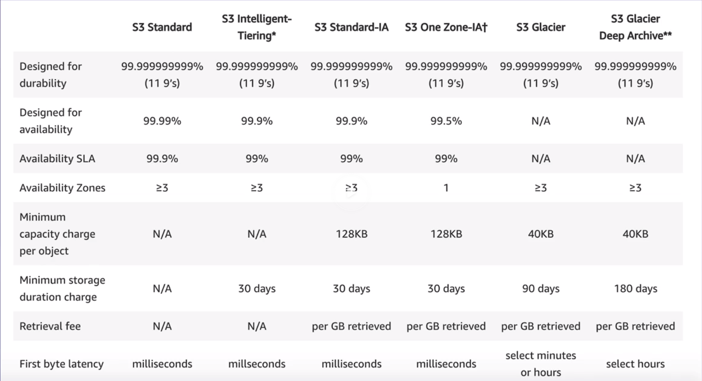

# **Intro**

- [**Intro**](#intro)
  - [**First lesson - What is cloud computing**](#first-lesson---what-is-cloud-computing)
    - [**Exam tips**](#exam-tips)
      - [Know the 6 advantaged of cloud](#know-the-6-advantaged-of-cloud)
      - [Know the 3 types of cloud computing](#know-the-3-types-of-cloud-computing)
      - [Know the 3 types of cloud computing deployments](#know-the-3-types-of-cloud-computing-deployments)
  - [**Second lesson - Around the world with AWS**](#second-lesson---around-the-world-with-aws)
    - [AWS global infrastructure](#aws-global-infrastructure)
    - [Choosing right AWS region](#choosing-right-aws-region)
  - [**Suport plans**](#suport-plans)
  - [**Let's start to Cloud! IAM**](#lets-start-to-cloud-iam)
    - [Exam tips](#exam-tips-1)
  - [**S3 101**](#s3-101)

## **First lesson - What is cloud computing**

### **Exam tips**

#### Know the 6 advantaged of cloud

- Trade capital expense for variable expense
- Benefit from massive economies of scale
- Stop guessing about capacity
- Increase speed and agility
- Stop spending money running and maintaining data center
- Go global in minutes

#### Know the 3 types of cloud computing

- Infrastructure as a service (IaaS) Example: EC2
- Platform as a service (PaaS) Example: Elastic Beanstalk, Amazon LightSail
- Software as a service (SaaS) Example: Gmail

#### Know the 3 types of cloud computing deployments

- Public cloud - Example: AWS
- Private cloud - Example: On premise
- Hybrid cloud - Mixture of public and private

## **Second lesson - Around the world with AWS**

### AWS global infrastructure

- 24 regions and multiple AZs
- Region is a geographical area, consists of two or more AZs
- Availability zone is one or more discrete data centers, each with redundant power, networking and conectivity, separated by miles
- Edge locations are endpoint for AWS for caching content, A site that CloudFront uses to cache copies of your content for faster delivery to users at any location.

### Choosing right AWS region

- Data soverinity laws
- Latency to end users
- AWS Services (us-east-1 primary region)

## **Suport plans**

- Basic - free
- Developer - ask technical question support center, 12-24 hour response - 29$
- Business - 24x7 support 1 hour response rate, full access to trusted advisor - 100$
- Enterprise - Business and TAM, 15 min response rate - 15.000$

## **Let's start to Cloud! IAM**

- Allows to create Users, roles, groups, etc.

- Root user is the email that was used to create the account
  - dont use it
- Activate MFA on root account
- Create individual IAM users
  - Programatic
    - CLI
    - SDK
  - Management console
- Use groups to assign permission
  - Users added to a group inheriet permissions from the group
- Password policy

### Exam tips

- Its global
- Access - console, cli, sdk
- Root account is the email, always have full acministrator access, secure it with MFA
- Group, place to store users
- Policy are write in JSON (JavaScript object notation) used to give permission

## **S3 101**

- Simple storage service, longest aws services
- Provides secure, durable, higghly-scalable object store
- Basically a place to put files, txt, videos, etc.
  - Flat files, that means, that doesnt change (data base files)
- Safe place to store files
- Object-based storages
  - Different from block-based storage to store operating system
- Data is spread across multiple devices and facilities
- Files from 0 to 5TB
- Files are stored in buckets - folder in the cloud
- "unlimited" storage
- S3 is a universal namespace - name must be unique
- uploading a file to s3 returns a HTTP code
- Object are like files
  - Key - name of the object
  - value - data made up of a sequence of bytes
  - Version ID
  - Metadata - Data about you are storing
  - subresources
- Data Consistency
  - Read after write consistency from PUTS of new objects
    - If you write a new file into S3 and read it inmediatly you will access the file
  - Eventual consistency for overwrite PUTS and DELETS (can some time to propagate)
    - If you update an existing file or delete a file and read it inmediatle, you may get older version, or you may not. Changes can take time
- Built for 99.99% availability for the S3 platform
- Amazon guarantee 99.9% availability
- Amazon guarantees 99.999999999% durability for s3 information

- Following feature
  - Tiered storage
  - Lifecycle management
  - Versioning
    - Version control
  - Encription
  - Secure data using Access control lists and bucket policies
    - Access control list is on individual file basis, one file or object can only be accessed by one person or role
    - bucket policies works on a bucket level

- Storage classes
  - S3 standard
    - Redundant across multiple devices in multiple facilities, desinged to sustain the loss of 2 facilities concurrently
  - S3 - IA (Infrequently accessed)
    - Data tha is less frequently accessed, but requires rapid access when needed. Lower fee than s3, but charged on retrieval
  - S3 on zone - IA
    - Low cost for infrquently accessed data, dont require multiple AZ recilience
  - S3 - Intelligent tiering
    - Optimize costs by automatically moving data to the most cost effective access tier, without performance impact
  - S3 glacier
    - secure, durable and low cos storage class for data archiving. Retrival times configurable from minutes to hours, cost cheaper than on-premise
  - S3 glacer deep archive
    - Amazon S3's lowest-cost storage class where a retrieval of 12 hours is acceptable

- Charges
  - Storage (per GB)
  - Requests (number of requests)
  - Storage management pricing
  - Data transfer pricing
  - Transfer acceleration
    - Enables fast, easy and secure transfers of files over long distances between your end users and an s3 bucket, takes advantage of edge locations, users upload files to the edge location instead of the bucket, and it thens goes through amazon internal network to the bucket
  - Cross region replication
    - Replicate a bucket in another region, it replicates automatically, disaster recovery
