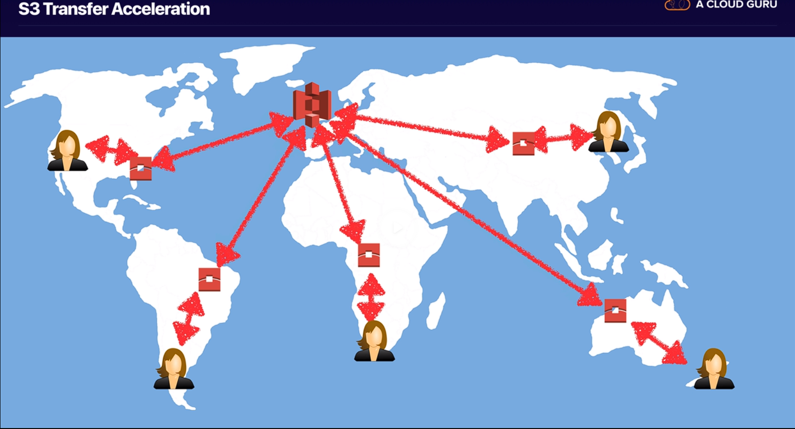
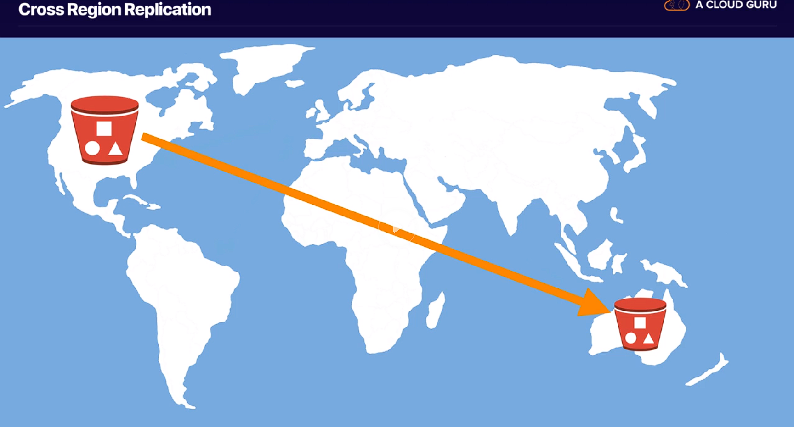
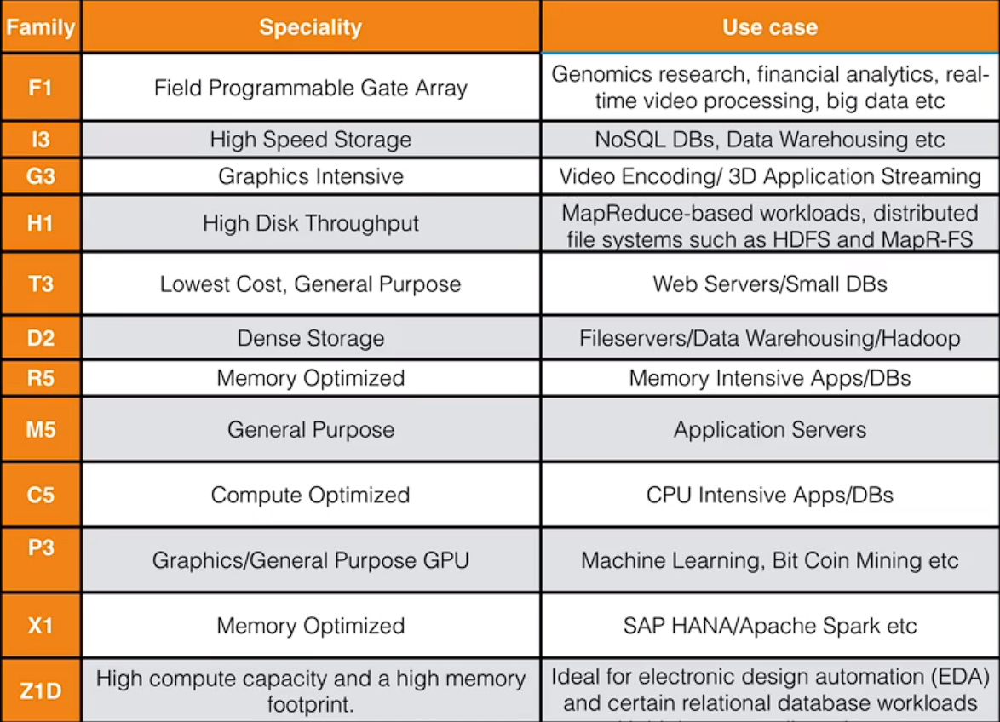
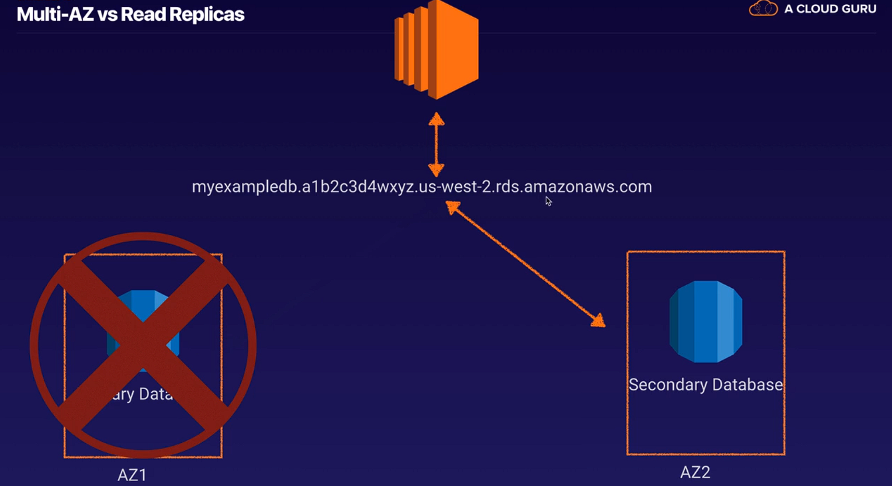
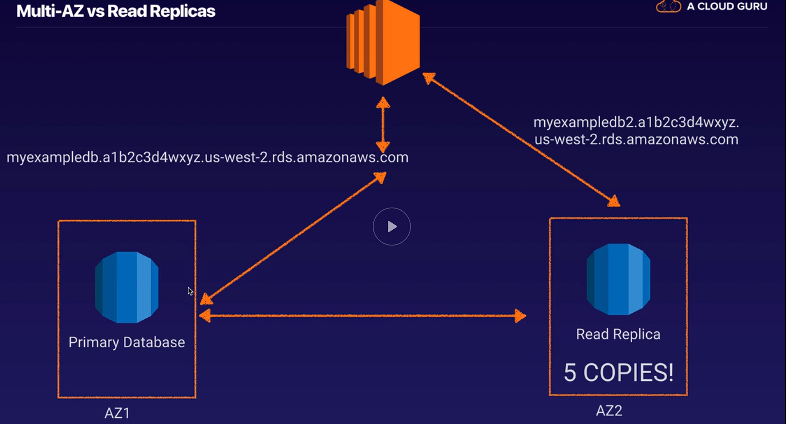

# **Intro**

- [**Intro**](#intro)
  - [**First lesson - What is cloud computing**](#first-lesson---what-is-cloud-computing)
    - [**Exam tips**](#exam-tips)
      - [Know the 6 advantaged of cloud](#know-the-6-advantaged-of-cloud)
      - [Know the 3 types of cloud computing](#know-the-3-types-of-cloud-computing)
      - [Know the 3 types of cloud computing deployments](#know-the-3-types-of-cloud-computing-deployments)
  - [**Second lesson - Around the world with AWS**](#second-lesson---around-the-world-with-aws)
    - [AWS global infrastructure](#aws-global-infrastructure)
    - [Choosing right AWS region](#choosing-right-aws-region)
  - [**Support plans**](#support-plans)
  - [**Let's start to Cloud! IAM**](#lets-start-to-cloud-iam)
    - [Exam tips](#exam-tips-1)
  - [**S3 101**](#s3-101)
    - [Tips](#tips)
    - [Create website using S3](#create-website-using-s3)
  - [**Cloudfront**](#cloudfront)
    - [Key terminology](#key-terminology)
    - [Distributions](#distributions)
    - [Notes](#notes)
  - [**EC2 101**](#ec2-101)
    - [Pricing models](#pricing-models)
      - [1. On demand](#1-on-demand)
      - [2. Reserved](#2-reserved)
      - [3. Spot](#3-spot)
      - [4. Dedicated hosts](#4-dedicated-hosts)
    - [Instance types](#instance-types)
    - [EBS](#ebs)
      - [Types](#types)
    - [EC2 - Tips](#ec2---tips)
    - [Common ports](#common-ports)
    - [Security group](#security-group)
    - [**Creating a web server on EC2**](#creating-a-web-server-on-ec2)
    - [User data](#user-data)
  - [**Command line**](#command-line)
  - [**Roles**](#roles)
  - [**Web server**](#web-server)
  - [**Lets use elastic load balancer**](#lets-use-elastic-load-balancer)
    - [ALB](#alb)
  - [**Databases 101**](#databases-101)
    - [RDS](#rds)
      - [RDS Flavors](#rds-flavors)
      - [Features](#features)
    - [Non-RDS](#non-rds)
      - [Non RDS Flavors](#non-rds-flavors)
    - [Data warehousing (Redshift)](#data-warehousing-redshift)
    - [ElastiCache](#elasticache)
      - [Example](#example)
      - [ElastiCache engines](#elasticache-engines)

## **First lesson - What is cloud computing**

### **Exam tips**

#### Know the 6 advantaged of cloud

- Trade capital expense for variable expense
- Benefit from massive economies of scale
- Stop guessing about capacity
- Increase speed and agility
- Stop spending money running and maintaining data center
- Go global in minutes

#### Know the 3 types of cloud computing

- Infrastructure as a service (IaaS) Example: EC2
- Platform as a service (PaaS) Example: Elastic Beanstalk, Amazon LightSail
- Software as a service (SaaS) Example: Gmail

#### Know the 3 types of cloud computing deployments

- Public cloud - Example: AWS
- Private cloud - Example: On premise
- Hybrid cloud - Mixture of public and private

## **Second lesson - Around the world with AWS**

### AWS global infrastructure

- 24 regions and multiple AZs
- Region is a geographical area, consists of two or more AZs
- Availability zone is one or more discrete data centers, each with redundant power, networking and connectivity, separated by miles
- Edge locations are endpoint for AWS for caching content, A site that CloudFront uses to cache copies of your content for faster delivery to users at any location.
  - Connected to AZs through Amazon private network

### Choosing right AWS region

- Data sovereignty laws
- Latency to end users
- AWS Services (us-east-1 primary region)

## **Support plans**

- Basic - free
- Developer - ask technical question support center, 12-24 hour response - 29$
- Business - 24x7 support 1 hour response rate, full access to trusted advisor - 100$
- Enterprise - Business and TAM, 15 min response rate - 15.000$

## **Let's start to Cloud! IAM**

- Allows to create Users, roles, groups, etc.

- Root user is the email that was used to create the account
  - don't use it
- Activate MFA on root account
- Create individual IAM users
  - Programmatic
    - CLI
    - SDK
  - Management console
- Use groups to assign permission
  - Users added to a group inherit permissions from the group
- Password policy

### Exam tips

- Its global
- Access - console, cli, sdk
- Root account is the email, always have full administrator access, secure it with MFA
- Group, place to store users
- Policy are write in JSON (JavaScript object notation) used to give permission

## **S3 101**

- Simple storage service, longest aws services
- Provides secure, durable, highly-scalable object store
- Basically a place to put files, txt, videos, etc.
  - Flat files, that means, that doesn't change (data base files)
- Safe place to store files
- Object-based storages
  - Different from block-based storage to store operating system
- Data is spread across multiple devices and facilities
- Files from 0 to 5TB
- Files are stored in buckets - folder in the cloud
- "unlimited" storage
- S3 is a universal namespace - name must be unique
- uploading a file to s3 returns a HTTP code
- Object are like files
  - Key - name of the object
  - value - data made up of a sequence of bytes
  - Version ID
  - Metadata - Data about you are storing
  - sub resources
- Data Consistency
  - Read after write consistency from PUTS of new objects
    - If you write a new file into S3 and read it immediately you will access the file
  - Eventual consistency for overwrite PUTS and DELETES (can some time to propagate)
    - If you update an existing file or delete a file and read it immediate, you may get older version, or you may not. Changes can take time
- Built for 99.99% availability for the S3 platform
- Amazon guarantee 99.9% availability
- Amazon guarantees 99.999999999% durability for s3 information

- Following feature
  - Tiered storage
  - Lifecycle management
  - Versioning
    - Version control
  - Encryption
  - Secure data using Access control lists and bucket policies
    - Access control list is on individual file basis, one file or object can only be accessed by one person or role
    - bucket policies works on a bucket level

- Storage classes
  - S3 standard
    - Redundant across multiple devices in multiple facilities, designed to sustain the loss of 2 facilities concurrently
  - S3 - IA (Infrequently accessed)
    - Data tha is less frequently accessed, but requires rapid access when needed. Lower fee than s3, but charged on retrieval
  - S3 one zone - IA
    - Low cost for infrequently accessed data, don't require multiple AZ resilience
  - S3 - Intelligent tiering
    - Optimize costs by automatically moving data to the most cost effective access tier, without performance impact
  - S3 glacier
    - secure, durable and low cos storage class for data archiving. Retrieval times configurable from minutes to hours, cost cheaper than on-premise
  - S3 glacier deep archive
    - Amazon S3's lowest-cost storage class where a retrieval of 12 hours is acceptable


- Charges
  - Storage (per GB)
  - Requests (number of requests)
  - Storage management pricing
  - Data transfer pricing
  - Transfer acceleration
    - Enables fast, easy and secure transfers of files over long distances between your end users and an s3 bucket, takes advantage of edge locations, users upload files to the edge location instead of the bucket, and it thens goes through amazon internal network to the bucket 
  - Cross region replication
    - Replicate a bucket in another region, it replicates automatically, disaster recovery 

### Tips

- When you view buckets you view them globally but you can have buckets in individual regions
- Replicate the contents of one bucket to another automatically using cross region replication
- Change the storage class and encryption of the objects on the fly
- Restricting bucket access
  - Bucket policies - applies across the whole bucket
  - Object policies - applies to individual files
  - IAM policies to users, groups and roles

### Create website using S3

Serverless website because S3 doesn't consist of any servers

make the s3 a static website hosting, setting

- the index document
- error document
- s3 public policy

Notes

- Static website means is html images, movies, etc. Its not dynamic, not connecting to DB showing dynamic content

- Dynamic website cannot be hosted on S3

- S3 scales automatically to meet demands

## **Cloudfront**

- Amazons content delivery network (CDN), is a system of distributed servers (network) that deliver webpages and other web content to a user based on the geographic locations of the user.

### Key terminology

- Edge location: This is the location the content will be cached. This is separate to an AWS region/AZ
- Origin: This is the origin of all the files that the CDN will distribute. can be S3, EC2 instance, ELB or R53
- Distribution: This is the name given the CDN which consists of a collection of Edge locations

Content is cached in places near the users for a faster response

- first users gets added latency since content is not cached
- all users after first will be able to access it from the cloudfront faster
- File is cached for a length of time
  - TTL Time to live - given in seconds, around 48 hours

Cloudfront can be used to deliver the entire website, including dynamic, static, streaming and interactive content using a global network of edge location
Request for the content are automatically routed to the nearest edge location

### Distributions

- Web distribution - used for website
- RTMP - used for media streaming
  - Used for flash, not commonly used

### Notes

- Edge location are not just READ only, you can write in them too (put an object on to them)
- You can clear cached object, but will be charged

## **EC2 101**

---

> EC2 is just a virtual server or servers in the cloud

### Pricing models

#### 1. On demand

Pay a fixed rate by the hour, no commitment

   1. low cost and flexibility
   2. short term, spiky unpredictable workloads, that cannot be interrupted
   3. first time apps

#### 2. Reserved

Capacity reservation, significant discount depending on the upfront payment its given the discount, contract are 1 or 3 years, and 3 years contract have the biggest discount

   1. steady state or predictable usage
   2. reserved capacity
   3. users able to make upfront payments

Types:

- Standard reserved instances: Up to 75%, cant change the EC2 family, or attributes (memory disk)
- Convertible reserved instances: up yo 54% capability of changing the instance attributes as long as the change results in the creation of equal or greater value
- Schedule reserved instances: available to launch within the time windows you reserve. match capacity to predictable schedule, day, week or month

#### 3. Spot

Enables you to bid what ever price you want for instance capacity, greater saving if applications have flexible star and end times

- Flexible star and end times
- Only feasible at very low compute prices
- User with urgent computing need for large amounts of additional capacity

#### 4. Dedicated hosts

Physical EC2 servers dedicated for your use. allows existing server-bound software licenses

- Regulatory requirements, may not support multi-tenant virtualization
- Great for licensing that doesn't support multi-tenant virtualization or cloud deployments
- Can be purchased
  - on-demand
  - reservation

### Instance types



FIGHT DR Mc PXZ

- F - for FPGA
- I - for IOPS
- G - Graphics
- H - High disk throughput
- T- Cheap general purpose
- D - Density
- R - RAM
- M - Main choice for general purpose apps
- C - Compute
- P - Graphics (Pics)
- X - Extreme memory
- Z - Extreme memory and CPU

### EBS

> Virtual hard disks that EC2 uses, every server has a disk, every virtual server has a virtual disk

Creates storage volumes and attach them to EC2 instances

- Create file systems
- Run data base
- Install OS
- Block device
- Sett up in a specific AZ, where they are automatically replicated

#### Types

- SSD
  - General purpose (GP2): balances price and performance
  - Provisioned IOPS SSD (IO1): High performance SSD, for low-latency or high-throughput workload
- Magnetic
  - Throughput optimized HDD (ST1): low cost, frequently accessed
  - Cold HDD (SC1): Lowest cost HDD, less frequently accessed, Files servers
  - Magnetic: previous generation

### EC2 - Tips

- Web service that provides resizable compute capacity
- Virtual server in the cloud
- Spot instance is terminated by AWS, not charged for partial usage, if terminated by the user, charged for the hour

### Common ports

- linux ssh 22
- microsoft remote desktop protocol port 3389
- HTTP port 80
- HTTPS port 443

### Security group

Virtual firewall

0.0.0.0/0 - everyone

### **Creating a web server on EC2**

- Create EC2
- open port 80 to world

### User data

```shell
!#/bin/bash
yum update -y
yum install httpd -y
service httpd start
chkconfig on
cd /var/www/html
echo "<html><body><h1> Text </h1></body></html>" > index.html
```

Command 1

> !#/bin/bash, everything under that line will run at root , when the EC2 boots up

Command 2

> chkconfig on, if the EC2 instance reboots, the apache servers stars automatically

## **Command line**

---

- Give credentials
  - aws configure
  - cd ~
  - cd .aws
- Use roles

## **Roles**

---

- Service that will use the role (trusted entities)
- Attach a policy
- Tags and names
- Credentials are not saved
- Safer way to interact
- Easier to manage
- Roles are universal, don't need a region

## **Web server**

---

Install a software that makes the EC2 a web sever

```shell
yum install httpd
service httpd start
cd /var/www/html
vim index.html
```

Then go to the Ip address of the instance

## **Lets use elastic load balancer**

---

- Application load balancers
  - Application aware, they can see into layer 7, make intelligent routing decisions
- Network load balancers
  - Used when needed ultra high performance and static IP addresses
- Classic load balancer
  - Getting phased out, cheap and cheerful

### ALB

- scheme
  - Internet facing
  - Internal
- Ip address type
  - ipv4
- AZs
- SG
- Routing
  - Target group
  - Health checks
- Register targets
- Can be accessed bye the DNS, it resolves to the targets

## **Databases 101**

---

> Relational databases can be seen as a spreadsheet

- Database (file)
- Tables
- Row
  - Fixed number of columns, can be added, but will affect every single row
- Fields (Columns)

### RDS

Amazons RDS

#### RDS Flavors

> OLTP: Online transaction process

- SQL Server
- Oracle
- MySQL Server
- PostgreSQL
- Aurora
- Maria DB

#### Features

- Multiple-AZ, for DR
  - Detected automatically when the main fails
  - 

- Read Replicas, literally a copy of the DB, for performance
  - Primary data is copied to the read replicas
  - up to 5 read replicas
  - there is no automatic fail over in case of failure to the read replicas
  - Set up EC2 instances to write to primary DB and all their reads from read replicas
  - 

### Non-RDS

- Collection = table
- Document = row
- Key value pairs = fields

More flexibility

- The columns in the table can vary
- Doesn't affect other rows in the data base

#### Non RDS Flavors

- DynamoDB

### Data warehousing (Redshift)

> OLAP: online analytics processing

- Used for BI. Used to pull in very large and complex data sets. do queries on data (current performance vs targets)
- Do online analytics processing away from the production DB
- Queries don't impact primary DB, impact secondary DB made for this queries
- Tools like:
  - Cognos
  - Jaspersoft
  - Oracle Hyperion
- Different type of architecture, from a DB perspective and infrastructure layer
- Amazon data warehousing is redshift

### ElastiCache

- Web service that makes it easy to deploy, operate and scale in-memory cache in the cloud.
- Improves the performance of web applications by allowing them to retrieve information from fast, managed, in-memory caches instead of slower disk-based DBs
- Takes a massive load of the production DB
- Primary queries are made in ElastiCache
- Secondary queries are made in the DB

#### Example

ElastiCache is used by Amazon.com to cache the most common queries from the databases, returns them faster

#### ElastiCache engines

- Memcached
- Redis
