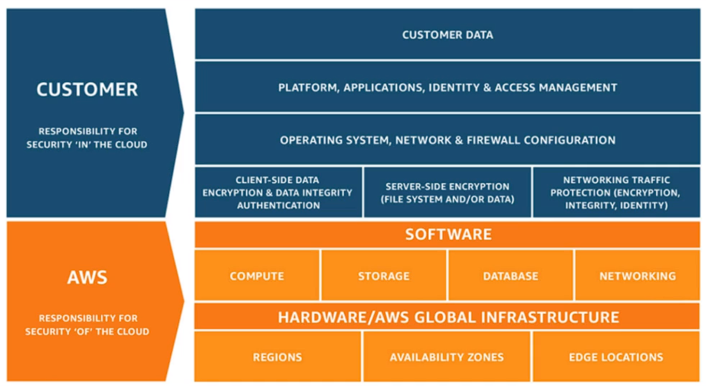
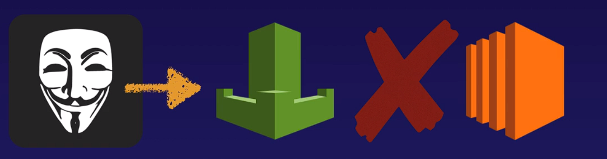

# Security In The Cloud notes

Third part of the a cloud guru course

- [Security In The Cloud notes](#security-in-the-cloud-notes)
  - [**Compliance and AWS artifact**](#compliance-and-aws-artifact)
    - [Programs](#programs)
    - [Artifact](#artifact)
  - [**Shared responsibility model**](#shared-responsibility-model)
    - [AWS responsibilities](#aws-responsibilities)
    - [Customer responsibilities](#customer-responsibilities)
    - [shared responsibility tips](#shared-responsibility-tips)
  - [**WAF**](#waf)
  - [**Shield**](#shield)
    - [Standard](#standard)
    - [Advanced](#advanced)
  - [**Inspector**](#inspector)
  - [**Trusted advisor**](#trusted-advisor)
    - [cost optimization](#cost-optimization)
    - [security](#security)
    - [fault tolerance](#fault-tolerance)
    - [performance](#performance)
    - [Service limits](#service-limits)
    - [core checks and recommendations](#core-checks-and-recommendations)
    - [full trusted advisor](#full-trusted-advisor)
  - [**Cloudtrail**](#cloudtrail)

## **Compliance and AWS artifact**

---

[amazon.com/compliance](https://aws.amazon.com/compliance/)

### Programs

- CSA
Cloud Security Alliance Controls

- ISO 9001
Global Quality Standard

- ISO 27001
Security Management Controls

- ISO 27017
Cloud Specific Controls

- ISO 27018
Personal Data Protection

- PCI DSS Level 1
Payment Card Standards

- SOC 1
Audit Controls Report

- SOC 2
Security, Availability, & Confidentiality Report

- SOC 3
General Controls Report

### Artifact

> comprehensive list of access-controlled documents relevant to compliance and security in the AWS cloud

## **Shared responsibility model**

---

[aws-shared-responsibility-model](https://aws.amazon.com/compliance/shared-responsibility-model/)

- AWS manages the security OF the Cloud
- customers manage the security IN the cloud

### AWS responsibilities

- data centers
- region
- edge locations
- hardware
- AZs
- software (hypervisor)
  - RDS OS

### Customer responsibilities

- EC2 instances patches
- client side data
- server side encryption
- networking traffic
- OS
- network
- FW
- IAM

### shared responsibility tips

- can it be done in the aws console or in ec2?
  - if yes, you are responsible (SG, IAM, patching OS)
  - if not, AWS is responsible
- encryption is a shared responsibility
  - you are responsible for turning encryption
  - aws is responsible for the encryption

## **WAF**

---

> web application firewall

- helps you protect your web application from common web exploits
- firewall that inspects web traffic, looking for malicious things
  - cross-site scripting
  - SQL injections
- normal firewall work at layer 4
- WAF works at layer 7, can see the traffic of the application layer

## **Shield**

> managed DDos protection service that safeguard web applications running on aws

DDoS:
Someone sends a lot of traffic, so much traffic that the server goes down

### Standard

- turns in automatically

### Advanced

- $3000 a month

## **Inspector**

---

> automated security assessment service that helps improve the security and compliance of applications deployed on AWS

- assess apps for vulnerabilities
- detailed list of findings
- agent installed on ec2, looking for common vulnerabilities
  - port open
  - OS patches
  - produce a report

## **Trusted advisor**

---

[Trusted advisor](https://aws.amazon.com/premiumsupport/technology/trusted-advisor/)

[Trusted advisor best practice checklist](https://aws.amazon.com/premiumsupport/technology/trusted-advisor/best-practice-checklist/)

> Helps reduce cost, increase performance, and improve security by optimizing your aws environment

- real time guidance
- entire AWS environment
- global

### cost optimization

- Amazon EC2 Reserved Instances optimization
- Low utilization Amazon EC2 instances
- Idle load balancers
- Underutilized Amazon EBS volumes

### security

- Security groups - Specific ports unrestricted (free)

### fault tolerance

- Amazon EBS snapshots

### performance

- High utilization Amazon EC2 instances

### Service limits

- Checks for service usage that is more than 80% of the service limit. Values are based on a snapshot, so your current usage might differ. Limit and usage data can take up to 24 hours to reflect any changes.

### core checks and recommendations

free

### full trusted advisor

business and enterprise only

## **Cloudtrail**

---

- monitors API call
- records everything on the AWS environment
- record management console and API calls
